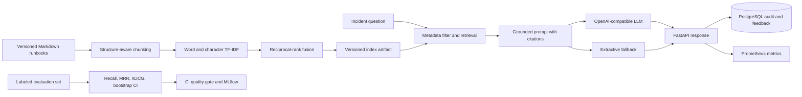

# Incident Copilot RAG

[](https://github.com/Moe-404/incident-copilot-rag/actions/workflows/ci.yml)
[](https://www.python.org/)
[](LICENSE)

A production-style Retrieval-Augmented Generation system that gives on-call engineers grounded
incident guidance from versioned DevOps runbooks. It demonstrates Python, SQL, information
retrieval, statistics, GenAI, MLOps, and DevOps in one reproducible portfolio project.

This is not a chatbot wrapper. Retrieval and generation are independently testable, every answer
includes source citations, offline operation is supported, and CI blocks changes that reduce
retrieval recall below the declared quality threshold.

## Architecture



## What the project demonstrates

| Job requirement | Evidence in this repository |
|---|---|
| Python | Typed package, FastAPI, ingestion, retrieval, evaluation, tests |
| SQL | PostgreSQL audit and feedback schema plus operational analytics query |
| ML and statistics | TF-IDF retrieval, rank fusion, MRR, nDCG, Recall@K, bootstrap 95% CI |
| MLOps | DVC pipeline, versioned corpus hash/index, MLflow experiment logging, quality gate |
| DevOps | Docker, Compose, Kubernetes manifests, GitHub Actions, health checks |
| GenAI | OpenAI-compatible LLM integration, grounded prompting, citations, safe fallback |
| Observability | Prometheus request, latency, retrieval score, and generator metrics |

## Retrieval design

Runbooks are split at Markdown section boundaries rather than arbitrary character offsets. Each
chunk keeps its document, service, severity, section, and source metadata. The retriever combines
word bigrams with character n-grams, then uses reciprocal-rank fusion. Character features improve
robustness for operational tokens such as `CrashLoopBackOff`, hostnames, and misspellings, while
word features preserve phrase meaning.

The evaluation set labels the relevant runbook for ten realistic questions. `make evaluate`
reports Recall@K, MRR, nDCG@K, p50/p95 latency, and a seeded bootstrap confidence interval. The
same command fails when Recall@4 is below 0.80.

Latest locally verified benchmark on the included dataset:

| Metric | Result |
|---|---:|
| Recall@4 | 1.000 |
| MRR | 0.950 |
| nDCG@4 | 0.963 |
| Recall@4 bootstrap 95% CI | [1.000, 1.000] |
| Retrieval latency p95 | 29.98 ms |

This small, curated dataset is a regression test rather than proof of general production quality;
the next experiment should expand it with real on-call questions and independently labeled chunks.

## Quick start

Use Python 3.11, 3.12, or 3.13:

```bash
python3.12 -m venv .venv
source .venv/bin/activate
pip install -e ".[dev,mlops]"
make index
make evaluate
make test
make run
```

Open <http://localhost:8000/docs> and submit:

```bash
curl -X POST http://localhost:8000/query \
  -H 'Content-Type: application/json' \
  -d '{"question":"A pod is in CrashLoopBackOff after a rollout. What should I inspect?","service":"kubernetes"}'
```

Without an LLM, the API returns a cited extractive answer, so development and CI remain free and
deterministic. To enable any OpenAI-compatible provider:

```bash
export LLM_BASE_URL=http://localhost:11434
export LLM_MODEL=your-model
export LLM_API_KEY=optional
```

The prompt treats retrieved content as reference data, requires a citation for each claim, and
prohibits invented commands or system state. Provider errors automatically use the safe fallback.

## Run the production-style stack

```bash
docker compose up --build
```

- API and Swagger: <http://localhost:8000/docs>
- Prometheus: <http://localhost:9090>
- PostgreSQL: query audit, citations, latency, and human relevance feedback

The included Kubernetes manifest provides two API replicas, resource limits, and readiness and
liveness probes. Replace the example image and create the database secret before deployment.

## Reproducibility and monitoring

```bash
dvc repro
MLFLOW_TRACKING_URI=http://localhost:5000 make evaluate
```

The knowledge corpus SHA-256 becomes the index version returned by the API. DVC rebuilds the index
when runbooks or retrieval code change. MLflow records the algorithm, Top-K setting, quality
metrics, and evaluation artifact when a tracking URI is configured.

Production requests record their question, service filter, generator, citations, and latency in
PostgreSQL. The `/feedback` endpoint records human relevance labels. Prometheus exposes system
health without placing question text in metric labels.

## Repository layout

```text
src/runbook_rag/       Chunking, retrieval, generation, API, SQL audit, evaluation
knowledge_base/        Versioned example incident runbooks
data/                  Labeled retrieval evaluation dataset
tests/                 Unit, API, safety, and quality-metric tests
sql/                   PostgreSQL schema and operational analytics
monitoring/            Prometheus configuration
deploy/                Kubernetes deployment and service
.github/workflows/     CI quality and container gates
dvc.yaml               Reproducible index and evaluation pipeline
```